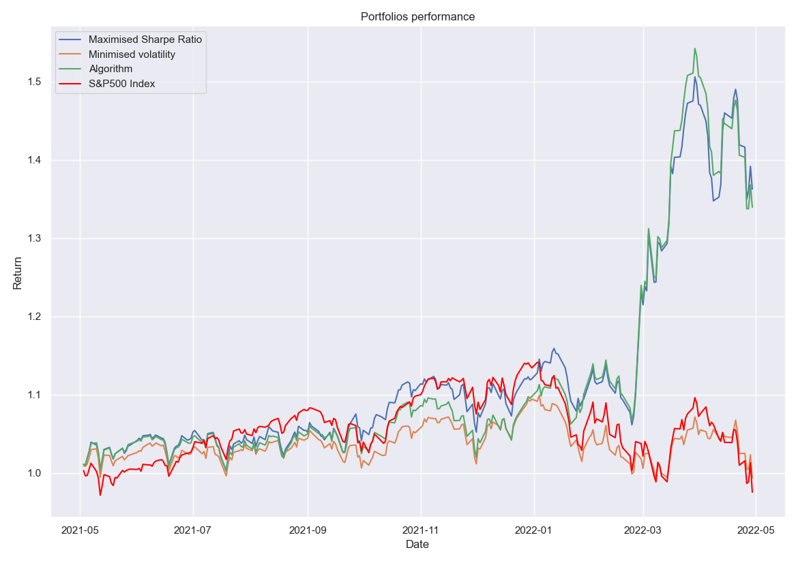

# Stock Movement Prediction and Portfolio Optimization

This project combines machine learning-based stock movement prediction with portfolio optimization using the Black-Litterman model. It is designed for S&P 500 stocks and demonstrates how to use predicted returns to construct an optimized portfolio.

## Methodology

1. **Data Retrieval**: Historical daily close prices for S&P 500 stocks are downloaded from Yahoo Finance. Additional required data (S&P500 constituents, market cap, risk-free rate) are loaded from CSVs (see below).
2. **Feature Engineering**: For each stock, features such as 30-day volatility, 30-day beta, and lagged returns are computed.
3. **Machine Learning**: A CatBoostRegressor is trained on rolling windows of historical data to predict next-day log returns for each stock.
4. **Portfolio Optimization**: The Black-Litterman model combines market priors and model predictions to generate posterior expected returns and covariances. The portfolio is optimized for maximum Sharpe ratio or minimum volatility.
5. **Evaluation**: The algorithm's performance is compared to the S&P 500 using cumulative returns and the Information Ratio (IR).

## Requirements

- Python 3.8+
- pandas
- numpy
- matplotlib
- seaborn
- yfinance
- catboost
- scikit-learn
- PyPortfolioOpt

Install requirements:
```bash
pip install -r requirements.txt
```

## Data Download

The following CSV files are required in the project directory:
- `S&P500.csv` ([Download](https://drive.google.com/uc?export=download&id=1qLoKEZHEjqvjgBB1CFX62oh7IGJptAk7))
- `market_cap.csv` ([Download](https://drive.google.com/uc?export=download&id=1YZmaQNzgpkj-DHbyFUhzzSDXKajabViF))
- `risk_free.csv` ([Download](https://drive.google.com/uc?export=download&id=1KRYPKo4ZEZdbq0RCmIutu6n93FYAjQDN))

Place these files in the same directory as `main.py`.

## How to Run

1. Download the required CSVs (see above).
2. Install dependencies:
   ```bash
   pip install -r requirements.txt
   ```
3. Run the script:
   ```bash
   python main.py
   ```
   Optional arguments (see `--help`):
   ```bash
   python main.py --start_date 2019-01-01 --end_date 2022-04-30 --n_days 252
   ```

## Sample Input/Output

**Input:** (default: last 252 trading days)
- S&P500.csv, market_cap.csv, risk_free.csv in the working directory

**Output:**
- Console output: cumulative returns, IR, and summary statistics
- Plot: Portfolio performance vs. S&P 500
- CSV: Daily returns (optional, see script)

## Example Output
```
Max Sharpe Cumulative Return: 1.15
Min Volatility Cumulative Return: 1.02
Algorithm Cumulative Return: 1.31
S&P500 Cumulative Return: 0.98
Information Ratio: 0.06
Annualized IR: 0.96
```



---

For more details, see the code and comments in `main.py`.


