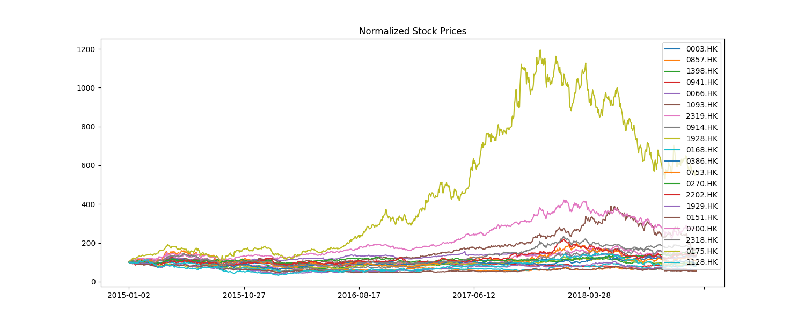
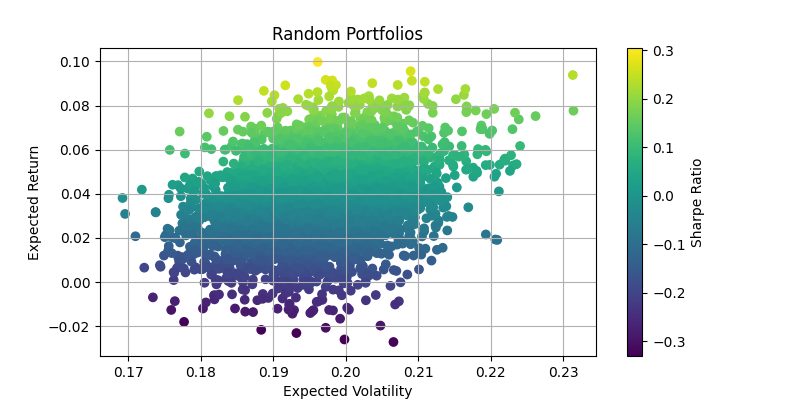
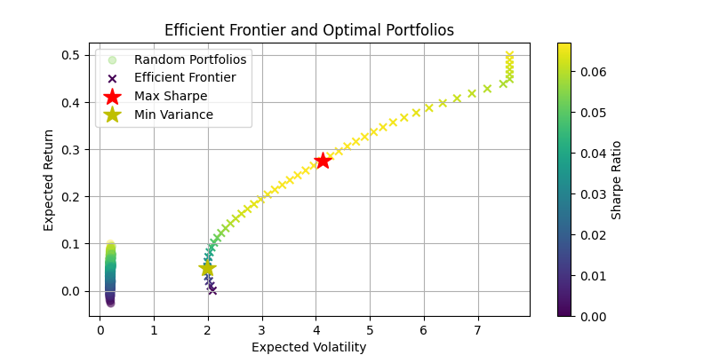

# uni-stock-portfolio-analysis

Stock Portfolio Recommendation (HSI Constituent Stocks)

## Overview
This project analyzes Hang Seng Index constituent stocks to recommend optimal portfolios using Modern Portfolio Theory. It calculates the efficient frontier, maximum Sharpe ratio, and minimum variance portfolios.

## Algorithm Used
- **Modern Portfolio Theory (MPT):**
  - Monte Carlo simulation to generate random portfolios
  - Portfolio optimization using the Sharpe ratio (risk-adjusted return)
  - Minimum variance portfolio optimization
  - Efficient frontier calculation using constrained optimization (SLSQP)

## Sample Input Data
Place your stock CSV files in `Data/Stock/`. Each file should be named as `<TICKER>.csv` and contain at least the following columns:

```
Date,Open,High,Low,Close,Adj Close,Volume
2015-01-02,11.040000,11.089700,10.791600,11.027600,9.683004,7759120
2015-01-05,10.816500,11.027600,10.816500,10.903400,9.573950,9485392
2015-01-06,10.853700,10.903400,10.741900,10.791600,9.475780,14333549
2015-01-07,10.741900,10.853700,10.741900,10.828900,9.508533,9287877
2015-01-08,10.915800,11.077200,10.853700,11.015100,9.672029,12560735
```

## How to Run
1. Install dependencies:
   ```bash
   pip install -r requirements.txt
   ```
2. Ensure your stock data is in `Data/Stock/` as shown above.
3. Run the analysis script:
   ```bash
   python project_analysis.py --data Data/Stock --results results
   ```

## Results
The script will generate the following output plots in the `results/` directory:
- `normalized_prices.png`: Normalized price trends for all stocks
- `random_portfolios.png`: Monte Carlo simulation of random portfolios (risk-return scatter)
- `efficient_frontier.png`: Efficient frontier with optimal portfolios highlighted

**Example Output Plots:**

- 
- 
- 

The script will also print the optimal weights and statistics for:
- The maximum Sharpe ratio portfolio
- The minimum variance portfolio

## Requirements
- Python 3.7+
- pandas
- numpy
- matplotlib
- scipy
- statsmodels
